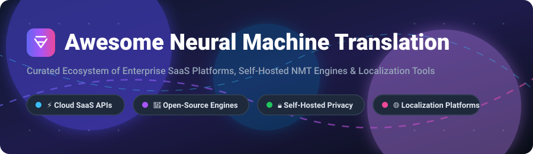

# 🌐 Awesome Neural Machine Translation (NMT) & Localization Ecosystem 🚀

<p align="center">
  <a href="https://github.com/ishandutta2007/Awesome-Awesome-Awesome"></a><a href="https://discord.gg/jc4xtF58Ve"></a>
  <a href="https://github.com/ishandutta2007/Awesome-Neural-Machine-Translation/stargazers"></a>
  <a href="https://github.com/ishandutta2007/Awesome-Neural-Machine-Translation/blob/main/LICENSE"></a>
  <a href="https://github.com/ishandutta2007/Awesome-Neural-Machine-Translation/pulls"></a>
  <a href="https://github.com/ishandutt22007"></a>
</p>

<p align="center">
  
</p>

---

## 📌 Ecosystem Overview & Keywords

Welcome to the ultimate curated list of **Neural Machine Translation (NMT) APIs**, **Commercial SaaS Localization Platforms**, and **Open-Source Self-Hosted Translation Engines**. Whether you are building real-time translation pipelines, deploying offline AI models, or managing enterprise software localization, this guide covers the entire landscape.

> 🔑 **SEO Keywords:** Neural Machine Translation, NMT Frameworks, Machine Translation API, Self-Hosted Translation, Offline Translation Models, OpenNMT, LibreTranslate, DeepL API, Google Cloud Translation, Software Localization Management Systems (TMS), Continuous Localization, Translation Memory (TM), LLM Translation, Multilingual NLP.

---

## 📑 Table of Contents

- [🏢 SaaS & Cloud Hosted Platforms](#-saas--cloud-hosted-platforms)
- [🧠 Open-Source Repositories & Frameworks](#-open-source-repositories--frameworks)
- [🛠️ Integration & Deployment Guide](#-integration--deployment-guide)
- [🤝 How to Contribute](#-how-to-contribute)
- [💖 Support & Sponsorship](#-support--sponsorship)
- [⚠️ Disclaimer](#%EF%B8%8F-disclaimer)
- [⭐ Star History](#-star-history)

---

## 🏢 SaaS & Cloud Hosted Platforms

> 📊 **Market Insights (2025–2026):** The global Machine Translation & Localization market is estimated at **$1.26 Billion – $1.40 Billion in 2025–2026** (projected to reach over **$2.17 Billion by 2030** at an 11%–15% CAGR). The market structure is **moderately concentrated** — hyperscale cloud providers (Microsoft, Google, Amazon) command foundational raw API volume due to vast compute resources, while specialized enterprise SaaS platforms (DeepL, Phrase, Smartling, Unbabel) capture high-value workflows through domain adaptation, human-in-the-loop review, and TMS automation.

The table below highlights top commercial NMT APIs and TMS solutions, sorted by **Company Size / Valuation (Descending)**:

| 🏢 Product / Platform | 📈 Company Size / Valuation | 💵 Starting Price | 🎁 Free Tier / Trial Limit | 🎯 Key Features & Best For |
| :--- | :--- | :--- | :--- | :--- |
| **[Microsoft Azure AI Translator](https://azure.microsoft.com/en-us/products/ai-services/ai-translator)** | **$3.1 Trillion** *(Market Cap)* | **$15.00** / 1,000,000 chars | **2,000,000 chars/month** free forever (F0 Tier) | 100+ languages, Custom Translator models, document translation API. **Best for Microsoft Enterprise Cloud integration.** |
| **[Google Cloud Translation API](https://cloud.google.com/translate)** | **$2.1 Trillion** *(Market Cap)* | **$20.00** / 1,000,000 chars | **500,000 chars/month** free forever ($10 credit equivalent) | 130+ languages, AutoML custom translation, adaptive Glossaries. **Best for broad language coverage & scale.** |
| **[Amazon Translate](https://aws.amazon.com/translate/)** | **$2.0 Trillion** *(Market Cap)* | **$15.00** / 1,000,000 chars | **2,000,000 chars/month** for 12 months (AWS Free Tier) | 75+ languages, active custom translation, real-time streaming text. **Best for AWS-native data pipelines.** |
| **[DeepL Pro API](https://www.deepl.com/)** | **$2.0 Billion** *(Valuation)* | **$5.49/mo** base + **$25.00** / 1M chars | **500,000 chars/month** free forever (DeepL API Free) | Industry-leading fluency for European & Asian language pairs. **Best for high-nuance translation quality.** |
| **[Phrase](https://phrase.com/)** | **$500 Million** *(Valuation)* | **$29.00** / user / month | **14-day free trial** *(Full platform features)* | Integrated TMS with MT auto-selection, developer API, string keys. **Best for developer-first agile localization.** |
| **[Smartling](https://www.smartling.com/)** | **$250 Million** *(Valuation)* | **$200.00** / month *(Growth tier)* | **14-day free trial** *(Full platform features)* | Enterprise translation management, visual context editor, automated routing. **Best for global brand web & app localization.** |
| **[Unbabel](https://unbabel.com/)** | **$150 Million** *(Valuation)* | **$1,199.00** / month *(Standard)* | **14-day free trial** *(Full platform access)* | Hybrid AI translation combined with human editor review loop. **Best for customer support ops (Zendesk/Salesforce).** |
| **[Systran Enterprise](https://www.systransoft.com/)** | **$80 Million** *(Valuation)* | **$15.00** / user / month | **14-day free trial** *(Full platform access)* | Secure on-premises or private cloud deployment, domain dictionaries. **Best for regulated industries & data privacy.** |
| **[Transifex](https://www.transifex.com/)** | **$50 Million** *(Valuation)* | **$140.00** / month *(Starter plan)* | **15-day free trial** *(Free plan for Open-Source)* | Continuous localization platform with GitHub & CI/CD workflow automation. **Best for open-source & product teams.** |
| **[ModernMT](https://www.modernmt.com/)** | **$20 Million** *(Valuation)* | **$18.00** / 1,000,000 chars | **14-day free trial** *(Includes 100k words / ~500k chars)* | Real-time adaptive NMT that learns dynamically from translation memory. **Best for Language Service Providers & CAT tools.** |

---

## 🧠 Open-Source Repositories & Frameworks

Open-source neural machine translation offers total data privacy, customization, and cost sovereignty. Below is the curated list of top open-source NMT engines, inference runtimes, and localization platforms, sorted by **GitHub Stars (Descending)**:

| 📦 Repository / Framework | ⭐ GitHub Stars | 📜 License | 🎯 Description & Primary Use Case |
| :--- | :---: | :---: | :--- |
| **[fairseq](https://github.com/facebookresearch/fairseq)** | [](https://github.com/facebookresearch/fairseq/stargazers) | `MIT` | Meta AI's sequence-to-sequence toolkit for custom NMT training, translation model research, and sequence generation. |
| **[LibreTranslate](https://github.com/LibreTranslate/LibreTranslate)** | [](https://github.com/LibreTranslate/LibreTranslate/stargazers) | `AGPL-3.0` | Free and open-source self-hosted translation API. Offline capable, powered by Argos Translate with Docker 1-command setup. |
| **[Seamless Communication](https://github.com/facebookresearch/seamless_communication)** | [](https://github.com/facebookresearch/seamless_communication/stargazers) | `CC-BY-NC-4.0` | Meta AI's SeamlessM4T v2 foundation models for expressive speech and text translation across 100+ languages. |
| **[OpenNMT-py](https://github.com/OpenNMT/OpenNMT-py)** | [](https://github.com/OpenNMT/OpenNMT-py/stargazers) | `MIT` | Reference PyTorch neural machine translation framework for training custom enterprise models and model deployment. |
| **[Argos Translate](https://github.com/argosopentech/argos-translate)** | [](https://github.com/argosopentech/argos-translate/stargazers) | `MIT` | Open-source offline NMT library written in Python. Serves as the core offline translation engine powering LibreTranslate. |
| **[Weblate](https://github.com/WeblateOrg/weblate)** | [](https://github.com/WeblateOrg/weblate/stargazers) | `GPL-3.0` | Web-based continuous localization management system with deep Git/GitHub integration, translation memory, and review flows. |
| **[CTranslate2](https://github.com/OpenNMT/CTranslate2)** | [](https://github.com/OpenNMT/CTranslate2/stargazers) | `MIT` | Ultra-fast C++ and Python inference engine for Transformer models featuring INT8/INT16 quantization on CPU and GPU. |
| **[Tolgee](https://github.com/tolgee/tolgee-platform)** | [](https://github.com/tolgee/tolgee-platform/stargazers) | `Apache-2.0` | Developer-friendly localization platform with in-context web app translation (ALT+Click), screenshot context, and MCP AI support. |
| **[Traduora](https://github.com/ever-co/ever-traduora)** | [](https://github.com/ever-co/ever-traduora/stargazers) | `AGPL-3.0` | Open translation management platform for engineering teams with instant Docker setup, JSON/XLIFF export, and REST APIs. |
| **[Pontoon](https://github.com/mozilla/pontoon)** | [](https://github.com/mozilla/pontoon/stargazers) | `BSD-3-Clause` | Mozilla's web-based localization system designed for community translation workflows and real-time website translation preview. |
| **[Accent](https://github.com/mirego/accent)** | [](https://github.com/mirego/accent/stargazers) | `BSD-3-Clause` | Developer-oriented translation management tool built with Elixir and GraphQL, optimized for asynchronous release pipelines. |
| **[OpenNMT-tf](https://github.com/OpenNMT/OpenNMT-tf)** | [](https://github.com/OpenNMT/OpenNMT-tf/stargazers) | `MIT` | TensorFlow 2 implementation of OpenNMT for scalable sequence-to-sequence model training and production serving. |
| **[Marian NMT](https://github.com/marian-nmt/marian)** | [](https://github.com/marian-nmt/marian/stargazers) | `MIT` | High-performance C++ NMT framework powering Microsoft Translator and University of Helsinki's OPUS-MT translation pipeline. |
| **[OPUS-MT](https://github.com/Helsinki-NLP/Opus-MT)** | [](https://github.com/Helsinki-NLP/Opus-MT/stargazers) | `Apache-2.0` | Pre-trained open neural machine translation models for hundreds of language pairs built by University of Helsinki. |
| **[FLORES-200 / NLLB](https://github.com/facebookresearch/flores)** | [](https://github.com/facebookresearch/flores/stargazers) | `CC-BY-SA-4.0` | Evaluation benchmark and datasets for Meta's No Language Left Behind (NLLB) model family covering 200 low-resource languages. |
| **[Stopes](https://github.com/facebookresearch/stopes)** | [](https://github.com/facebookresearch/stopes/stargazers) | `MIT` | Meta AI's data preparation pipeline toolkit for mining parallel translation corpora and dataset verification at scale. |
| **[TraductAL](https://github.com/Rogaton/TraductAL)** | [](https://github.com/Rogaton/TraductAL/stargazers) | `MIT` | Neuro-symbolic offline translation system combining NLLB-200 and Apertus-8B models with Prolog verification. |

---

## 🛠️ Integration & Deployment Guide

Depending on your security, budget, and operational constraints, here is how to select the right architecture:

```
                      ┌──────────────────────────────────────────────┐
                      │    Do you require 100% Data Sovereignty?    │
                      └──────────────────────┬───────────────────────┘
                                             │
                       ┌─────────────────────┴─────────────────────┐
                       │                                           │
                    [ YES ]                                     [ NO ]
                       │                                           │
      ┌────────────────┴─────────────────┐       ┌─────────────────┴──────────────────┐
      │  Self-Hosted / Open-Source NMT   │       │     Cloud SaaS API / Platform      │
      └────────────────┬─────────────────┘       └─────────────────┬──────────────────┘
                       │                                           │
         ┌─────────────┴─────────────┐               ┌─────────────┴─────────────┐
         │                           │               │                           │
  [ High Volume API ]       [ Visual Localization ] [ Raw API Speed ]      [ High Quality & Nuance ]
         │                           │               │                           │
  • LibreTranslate            • Weblate       • Google Cloud API           • DeepL Pro API
  • CTranslate2 + OpenNMT     • Tolgee        • Azure AI Translator        • ModernMT
```

---

## 🤝 How to Contribute

Contributions are welcome! Please help keep this repository accurate, up-to-date, and comprehensive.

1. 🍴 **Fork** this repository.
2. 📝 **Add/Modify** entries in `README.md` following the tabular schema.
3. 📌 Ensure pricing, free tier limits, and GitHub star badges follow the standard format.
4. 🚀 **Submit a Pull Request** with a brief summary of additions.

---

## 💖 Support & Sponsorship

Thank you for exploring **Awesome Neural Machine Translation**! If this repository has saved you time, helped you evaluate NMT frameworks, or supported your localization infrastructure, please consider supporting the project:

- ⭐ **Star this repository** on GitHub to increase its visibility.
- 🔀 **Fork & Share** with your network, team, and developer communities.
- ☕ **Sponsor / Buy me a Coffee:** Support ongoing maintenance, updates, and ecosystem research via the [GitHub Sponsor Dashboard](https://github.com/sponsors/ishandutta2007).

---

## ⚠️ Disclaimer

- **Community Curated:** This list is maintained for information and educational purposes only.
- **Data Privacy & Security:** Cloud translation APIs process data on vendor servers. For strict data compliance (HIPAA, GDPR, SOC2), utilize self-hosted engines such as LibreTranslate or secure enterprise options like Systran.
- **Pricing Subject to Change:** Pricing plans and free quotas are verified periodically; check official vendor pages for current details.

---

## ⭐ Star History

[](https://star-history.dera.page/#ishandutta2007/Awesome-Neural-Machine-Translation&type=date&legend=top-left)

---

<p align="center">
  <b>Made with ❤️ for localization engineers, developers, and machine translation researchers worldwide.</b>
</p>
